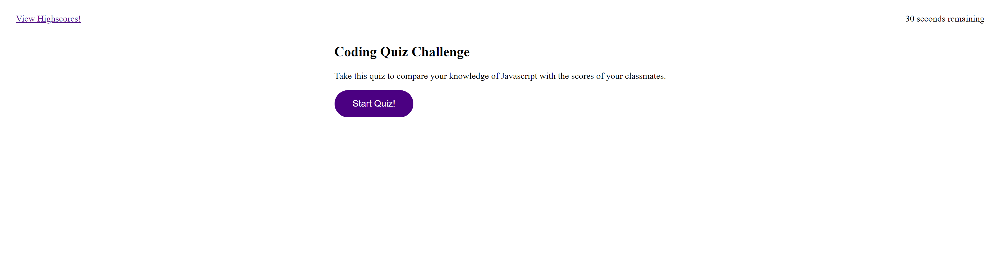

# Code Quiz
 &nbsp;&nbsp;&nbsp;&nbsp; &nbsp;&nbsp;&nbsp;&nbsp; &nbsp;&nbsp;&nbsp;&nbsp;

## Description :memo: 
  Webpage application that allows users to take a quiz to test thier coding knowledge, and compare thier scores with their peers.

## Table of Contents :trophy: 
* [Usage](#usage)
* [Contributing](#contributing)
  
  
  
## Usage
This project is used to test the user's coding knowledge and compare scores with their peers.

Launch webpage [here](https://karina5151.github.io/Code-Quiz/)

  
  
## Contributing
This application was developed by Karina Clausen.

The technologies that made this possible are:
* HTML
* CSS
* JavaScript

  
  
  
  
 ---

## Questions :question:

For any questions, please contact me using the information below:

:octocat: GitHub: [@Karina5151](https://github.com/Karina5151)

:envelope: Email: karina.clausen.11@gmail.com
